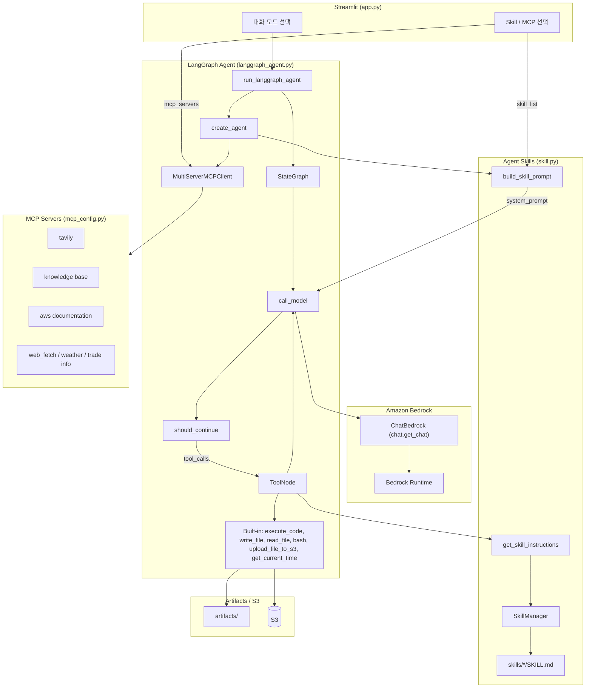

# MCP/SKILL을 이용한 Agent의 구현

Agent는 MCP뿐 아니라 [Skill](https://github.com/anthropics/skills)을 활용하여 다양한 기능을 편리하게 구현할 수 있습니다. 여기에서는 [LangGraph](https://www.langchain.com/langgraph)에서 Agent skill을 활용하는 방법에 대해 설명합니다. 전체적인 architecture는 아래와 같습니다. CloudFront - ALB - EC2로 streamlit을 안전하게 제공하고, LangGraph Agent에 MCP와 Skills 기능을 구현합니다.


- **MCP**: 외부 도구(검색, Knowledge Base, 날씨 등)를 구조화된 tool로 제공
- **Skills**: `SKILL.md` 기반 절차·도메인 지침을 온디맨드로 로드 (`get_skill_instructions`)

## 설치

인프라(S3, CloudFront, Knowledge Base 등)는 [installer.md](./installer.md)를 참고해 배포할 수 있습니다.

```text
python installer.py
```

삭제는 `python uninstaller.py`입니다. 상세는 [installer.md](./installer.md)를 참고하세요.

### 사전 준비

1. AWS 환경을 잘 활용하기 위해서는 [AWS CLI를 설치](https://docs.aws.amazon.com/ko_kr/cli/v1/userguide/cli-chap-install.html)하여야 합니다. EC2에서 배포하는 경우에는 별도로 설치가 필요하지 않습니다. Local에 설치시는 아래 명령어를 참조합니다.

```text
curl "https://awscli.amazonaws.com/awscli-exe-linux-x86_64.zip" -o "awscliv2.zip" 
unzip awscliv2.zip
sudo ./aws/install
```

AWS credential을 아래와 같이 AWS CLI를 이용해 등록합니다.

```text
aws configure
```

2. 설치하다가 발생하는 각종 문제는 [Kiro-cli](https://aws.amazon.com/ko/blogs/korea/kiro-general-availability/)를 이용해 빠르게 수정합니다. 아래와 같이 설치할 수 있지만, Windows에서는 [Kiro 설치](https://kiro.dev/downloads/)에서 다운로드 설치합니다. 실행시는 셀에서 "kiro-cli"라고 입력합니다. (Windows 미지원)

```python
curl -fsSL https://cli.kiro.dev/install | bash
```

venv로 환경을 구성하면 편리하게 패키지를 관리합니다. 아래와 같이 환경을 설정합니다.

```text
python -m venv .venv
source .venv/bin/activate
```


3. [knowledge-base-with-s3-vector.md](./knowledge-base-with-s3-vector.md)에 따라 AWS의 완전관리형 RAG 서비스인 Knowledge Base를 설치합니다. Vector Store로 S3 Vector를 선택하면 embedding된 문서 정보가 Amazon S3에 저장되므로 매우 경제적입니다. 다만 성능을 최적화하기 원할때에는 S3 Vector 보다는 OpenSearch Serverless등을 활용합니다.

4. 인터넷 검색을 위하여 [Tavily Search](https://app.tavily.com/sign-in)에 접속하여 가입 후 API Key를 발급합니다. 이것은 tvly-로 시작합니다.  

5. git code를 다운로드합니다.

```text
git clone https://github.com/kyopark2014/langgraph-skills
```

6. 아래 명령어로 config.json을 생성합니다. 이때 앞에서 생성한 "S3 bucket name", "Knowledge Base ID", "Tavily API Key"을 입력합니다.

```text
python update_config.py
```

7. 다운로드 받은 github 폴더로 이동한 후에 아래와 같이 필요한 패키지를 추가로 설치 합니다.

```text
pip install -r requirement.txt
```

8. MCP `web_fetch`(`mcp-server-fetch-typescript`, Playwright 포함)로 웹을 markdown 등으로 가져오려면 저장소 루트에서 아래 명령으로 Node 패키지를 설치합니다.

```text
npm install
```

렌더된 HTML을 가져오는 도구를 쓸 때는 최초 한 번 `npx playwright install`으로 브라우저 바이너리를 설치해야 할 수 있습니다.

### 실행

```text
streamlit run application/app.py
```

## Skills

[Agent Skills](https://agentskills.io/specification)은 AI agent에게 특정 작업 수행 방법을 가르치는 재사용 가능한 지침 패키지입니다. Skill은 context를 효율적으로 관리하기 위해 **discovery → activation → execution** 과정을 거칩니다.

1. **Discovery**: agent가 관련 skill의 `name`과 `description`을 확인
2. **Activation**: `SKILL.md`의 instruction(본문)을 로드
3. **Execution**: 필요 시 referenced file을 읽거나 bundled code를 `execute_code` / `bash`로 실행

각 스킬은 `SKILL.md` 파일로 구성되며, YAML 프론트매터(`name`, `description`)와 상세 지침(워크플로, 코드 패턴 등)으로 이루어져 있습니다.

### Operation Architecture



| 모드 | 모듈 | 설명 |
|------|------|------|
| 일상적인 대화 | `chat.general_conversation` | 대화 이력 + ChatBedrock 스트리밍 |
| RAG | `chat.run_rag_with_knowledge_base` | Bedrock Knowledge Base 검색(`retrieve`) 후 ChatBedrock으로 답변 생성 |
| **Agent** | `langgraph_agent.run_langgraph_agent` | LangGraph StateGraph + built-in tools + MCP + Skills (단일 턴) |
| **Agent (Chat)** | `langgraph_agent.run_langgraph_agent` | Agent와 동일 + LangGraph checkpointer로 대화 이력 유지 |
| 이미지 분석 | `chat.summarize_image` | ChatBedrock 멀티모달 (이미지 + 텍스트) 분석 |

### Progressive Disclosure

시스템 프롬프트에는 스킬의 **이름과 설명만** XML로 넣고, 상세 지침은 agent가 `get_skill_instructions`를 호출해 **필요할 때만** 로드합니다. 프롬프트 크기를 줄이면서도 여러 스킬을 선택적으로 쓸 수 있습니다.

```xml
<available_skills>
  <skill>
    <name>docx</name>
    <description>Word 문서(.docx) 생성/편집/분석 ...</description>
  </skill>
  <skill>
    <name>pdf</name>
    <description>PDF 파일 읽기/병합/분할/OCR/폼 처리 등</description>
  </skill>
</available_skills>
```

### 스킬의 구조

각 스킬은 `SKILL.md`가 핵심이며, 필요 시 `scripts/`, `references/`, `assets/` 등을 둡니다.

```text
application/skills/
├── docx/
│   ├── SKILL.md
│   └── scripts/
├── pdf/
│   └── SKILL.md
├── pptx/
│   └── SKILL.md
└── skill-creator/
    └── SKILL.md
```

`SKILL.md` 예 (프론트매터 + 본문):

```markdown
---
name: docx
description: Use this skill whenever the user wants to create, read, edit, or manipulate Word documents (.docx files). ...
---

# DOCX creation, editing, and analysis

## Overview
A .docx file is a ZIP archive containing XML files.
...
```

### 포함된 스킬

이 프로젝트는 `application/skills/` 아래 **베이스 스킬만** 사용합니다 (플러그인 스킬 없음).

| 스킬 | 설명 |
|------|------|
| docx | Word 문서 생성/편집/분석 |
| pdf | PDF 읽기/병합/분할/OCR/폼 처리 |
| pptx | PowerPoint 읽기/편집/생성 |
| xlsx | 스프레드시트 작업 |
| myslide | AWS 테마 프레젠테이션 생성 |
| ppt-translator | PPT 번역 |
| pdf2img | PDF → 이미지 |
| img2text | 이미지 → 텍스트(Bedrock 멀티모달) |
| skill-creator | 새 스킬 설계/패키징 가이드 |
| graphify | 지식 그래프 구축/조회 |
| tavily-search | Tavily 검색 스크립트 |
| retrieve | Bedrock Knowledge Base RAG |
| kma-weather / search-weather | 날씨 조회 |
| notion / gog | Notion / Google Workspace 가이드 |
| browser-use | 브라우저 자동화 |
| frontend-design | UI/프론트엔드 디자인 |
| memory-manager | MEMORY.md 기반 메모리 관리 |

활성화할 스킬은 `config.json`의 `default_skills`와 Streamlit 사이드바 **Skill Config** 체크박스로 선택합니다. **Skill Mode**가 켜져 있어야 skill tool/프롬프트가 agent에 붙습니다.

### 스킬의 동작 흐름

[skill.py](./application/skill.py) 기준 흐름:

1. **스킬 탐색**: `SkillManager`가 `skills/*/SKILL.md`를 스캔해 레지스트리에 등록
2. **프롬프트 구성**: `build_skill_prompt(skill_info)`가 선택된 스킬의 이름/설명을 `<available_skills>` XML로 시스템 프롬프트에 포함
3. **지침 로드**: 관련 요청이면 agent가 `get_skill_instructions(skill_name)` 호출
4. **작업 수행**: 지침에 따라 `execute_code`, `bash`, `write_file` 등 실행 (MCP 도구와 병행 가능)
5. **결과 전달**: 산출물은 `artifacts/`에 두고, 설정 시 `upload_file_to_s3`로 URL 제공

### LangGraph에서 Skill 구현

#### 1) Agent 생성 (`create_agent`)

[langgraph_agent.py](./application/langgraph_agent.py)의 `create_agent`가 builtin + MCP + Skill을 한 번에 조립합니다. Skill Mode가 `Enable`일 때만 skill tool과 skill 프롬프트를 붙입니다.

```python
async def create_agent(mcp_servers: list, skill_list: list, history_mode: str = "Disable"):
    tools = get_builtin_tools()  # execute_code, write_file, read_file, bash, ...

    mcp_json = mcp_config.load_selected_config(mcp_servers)
    server_params = load_multiple_mcp_server_parameters(mcp_json)
    client = MultiServerMCPClient(server_params)
    mcp_tools = await client.get_tools()
    tools.extend(mcp_tools)

    if chat.skill_mode == "Enable":
        tools.extend(skill.get_skill_tools())  # get_skill_instructions
        skill_info = skill.get_skill_info(skill_list)
        system_prompt = skill.build_skill_prompt(skill_info)
    else:
        system_prompt = BASE_SYSTEM_PROMPT

    app = buildChatAgent(tools)  # or buildChatAgentWithHistory
    agent_config = {
        "recursion_limit": 100,
        "configurable": {
            "thread_id": chat.user_id,
            "tools": tools,
            "system_prompt": system_prompt,
        },
        "tools": tools,
        "system_prompt": system_prompt,
    }
    return app, agent_config
```

#### 2) Builtin tools

```python
def get_builtin_tools() -> list:
    tools = [execute_code, write_file, read_file, bash, get_current_time]
    if sharing_url or config.get("s3_bucket"):
        tools.append(upload_file_to_s3)
    return tools
```

`get_skill_instructions`는 builtin이 아니라 [skill.py](./application/skill.py)의 `get_skill_tools()`로 별도 추가됩니다.

```python
@tool
def get_skill_instructions(skill_name: str) -> str:
    """Load the full instructions for a specific skill by name."""
    manager = _get_manager()
    instructions = manager.get_skill_instructions(skill_name)
    if instructions:
        return instructions
    available = ", ".join(manager.registry.keys())
    return f"Skill '{skill_name}' not found. Available skills: {available}"
```

#### 3) SkillManager / 프롬프트

```python
@dataclass
class Skill:
    name: str
    description: str
    instructions: str
    path: str

class SkillManager:
    def __init__(self, skills_dir: str = SKILLS_DIR):
        self.registry: dict[str, Skill] = {}
        self._discover(skills_dir)

    def _discover(self, skills_dir: str):
        for entry in os.listdir(skills_dir):
            skill_md = os.path.join(skills_dir, entry, "SKILL.md")
            if os.path.isfile(skill_md):
                meta, instructions = self._parse_skill_md(skill_md)
                skill = Skill(
                    name=meta.get("name", entry),
                    description=meta.get("description", ""),
                    instructions=instructions,
                    path=os.path.join(skills_dir, entry),
                )
                self.registry[skill.name] = skill

def build_skill_prompt(skill_info: list) -> str:
    path_info = (
        f"## Paths ...\n"
        f"- WORKING_DIR: {WORKING_DIR}\n"
        f"- ARTIFACTS_DIR: {ARTIFACTS_DIR}\n"
    )
    skills_xml = get_skills_xml(skill_info)
    return f"{SKILL_SYSTEM_PROMPT}\n{path_info}\n{skills_xml}\n{SKILL_USAGE_GUIDE}"
```

#### 4) UI → Agent 호출

[app.py](./application/app.py)에서 Skill/MCP를 선택한 뒤 `chat.run_langgraph_agent`로 위임하고, 실제 실행은 `langgraph_agent.run_langgraph_agent`가 담당합니다.

```python
# app.py (Agent / Agent Chat)
response, image_url = asyncio.run(chat.run_langgraph_agent(
    query=prompt,
    mcp_servers=mcp_servers,
    skill_list=selected_skills,
    history_mode=history_mode,
    notification_queue=notification_queue,
))
```

```python
# chat.py — thin wrapper
async def run_langgraph_agent(query, mcp_servers, history_mode, notification_queue, skill_list=None):
    return await langgraph_agent.run_langgraph_agent(
        query=query,
        mcp_servers=mcp_servers,
        skill_list=skill_list or [],
        history_mode=history_mode,
        notification_queue=notification_queue,
    )
```

MCP/skill/skill_mode가 바뀌면 agent를 재생성하고, 같으면 캐시된 그래프를 재사용합니다.

### Skill 생성

[skill-creator](./application/skills/skill-creator/SKILL.md)를 선택하면 새 스킬 패키징을 안내합니다.

```text
├── SKILL.md              # 필수
│   ├── YAML frontmatter  # name, description (필수)
│   └── Markdown body     # 상세 지침 (필수)
└── Bundled Resources     # 선택
    ├── scripts/          # 실행 코드
    ├── references/       # 온디맨드 문서
    └── assets/           # 템플릿, 아이콘, 폰트 등
```

새 폴더를 `application/skills/<name>/`에 두고 `SKILL.md`를 추가하면 다음 앱 실행(또는 SkillManager 재생성) 시 UI 체크박스에 나타납니다.

## 배포하기

### EC2로 배포하기

아래와 같이 python, pip, git, boto3를 설치합니다.

```text
sudo yum install python3 python3-pip git docker -y
pip install "boto3>=1.43.32" "botocore>=1.43.32"
```

아래와 같이 git source를 가져옵니다.

```python
git clone https://github.com/kyopark2014/langgraph-skills
```

아래와 같이 installer.py를 이용해 설치를 시작합니다.

```python
cd langgraph-skills && python3 installer.py
```

인프라가 더이상 필요없을 때에는 uninstaller.py를 이용해 제거합니다.

```text
python uninstaller.py
```

공유 API 시크릿(`tavilyapikey`, `notionapikey` 등)은 기본적으로 삭제하지 않습니다. 상세는 [installer.md](./installer.md)를 참조하세요.

### 실행하기

AWS 환경을 잘 활용하기 위해서는 [AWS CLI를 설치](https://docs.aws.amazon.com/ko_kr/cli/v1/userguide/cli-chap-install.html)하여야 합니다. EC2에서 배포하는 경우에는 별도로 설치가 필요하지 않습니다. Local에 설치시는 아래 명령어를 참조합니다.

```text
curl "https://awscli.amazonaws.com/awscli-exe-linux-x86_64.zip" -o "awscliv2.zip" 
unzip awscliv2.zip
sudo ./aws/install
```

AWS credential을 아래와 같이 AWS CLI를 이용해 등록합니다.

```text
aws configure
```

설치하다가 발생하는 각종 문제는 [Kiro-cli](https://aws.amazon.com/ko/blogs/korea/kiro-general-availability/)를 이용해 빠르게 수정합니다. 아래와 같이 설치할 수 있지만, Windows에서는 [Kiro 설치](https://kiro.dev/downloads/)에서 다운로드 설치합니다. 실행시는 셀에서 "kiro-cli"라고 입력합니다. 

```python
curl -fsSL https://cli.kiro.dev/install | bash
```

venv로 환경을 구성하면 편리하게 패키지를 관리합니다. 아래와 같이 환경을 설정합니다.

```text
python -m venv .venv
source .venv/bin/activate
```

이후 다운로드 받은 github 폴더로 이동한 후에 아래와 같이 필요한 패키지를 추가로 설치 합니다.

```text
pip install -r requirements.txt
```

이후 아래와 같은 명령어로 streamlit을 실행합니다. 

```text
streamlit run application/app.py
```

### MCP

필요한 MCP 설정은 아래를 참조합니다. 

- [Tavily](https://github.com/kyopark2014/mcp/blob/main/mcp-tavily.md): Tavily를 이용해 인터넷을 검색합니다. [installer.py](./installer.py)에서 공유 secret `tavilyapikey`로 설정한 뒤 [utils.py](./application/utils.py) / `config.json`에서 `TAVILY_API_KEY`로 활용합니다.

- [RAG](https://github.com/kyopark2014/mcp/blob/main/mcp-rag.md): Knowledge Base를 이용해 RAG를 활용합니다. IAM 인증을 이용하므로 별도로 credential 설정하지 않습니다.

- [web_fetch](https://github.com/kyopark2014/mcp/blob/main/mcp-web-fetch.md): playwright기반으로 url의 문서를 markdown으로 불러올 수 있습니다. 별도 인증이 필요하지 않습니다. 루트에서 `npm install`이 필요할 수 있습니다.

- [aws documentation](https://awslabs.github.io/mcp/servers/aws-documentation-mcp-server/): AWS 공식 문서 검색 (`uvx awslabs.aws-documentation-mcp-server`).

- [Notion](https://github.com/kyopark2014/mcp/blob/main/mcp-notion.md): Notion을 읽거나 쓸 수 있습니다. 공유 secret `notionapikey`를 사용합니다.

- [Slack](https://github.com/kyopark2014/mcp/blob/main/mcp-slack.md): Slack 내용을 조회하고 메시지를 보낼 수 있습니다. `SLACK_TEAM_ID`, `SLACK_BOT_TOKEN` / 공유 secret `slackapikey`로 설정합니다.

### Memory

Agent의 장기 기억은 [Amazon Bedrock AgentCore Memory](https://docs.aws.amazon.com/bedrock-agentcore/latest/devguide/memory.html)를 사용할 수 있습니다. [installer.py](./installer.py)가 AgentCore Memory 역할·리소스를 생성합니다. 대화에서 추출된 사용자 선호도·프로파일은 namespace(기본값: `/users/{actor_id}`)에 저장되며, **Memory MCP는 조회 전용**으로 동작합니다. 저장(`record`)·삭제(`delete`)는 MCP에서 제공하지 않습니다.

관련 구현 패턴(동일 스택 참조):

- `mcp_server_memory.py`: MCP 서버 (`recall_memory` 도구 노출)
- `mcp_memory.py`: AgentCore Memory Retrieve/List/Get 호출
- `agentcore_memory.py`: memory id / actor / session / namespace 관리 및 대화 저장
- [mcp_config.py](./application/mcp_config.py): `memory` MCP 설정 (추가 시)

워크스페이스 Markdown 메모리용으로는 Skill `memory-manager`(`MEMORY.md`, `memory/*.md`)를 선택할 수 있습니다.

#### 활성화

Streamlit Agent / Agent (Chat) 모드의 MCP 옵션에서 `memory`를 선택합니다(설정에 추가된 경우).

- **Memory MCP**: AgentCore 장기 기억을 `recall_memory`로 조회
- **memory-manager Skill**: 파일 기반 메모리 지침을 progressive disclosure로 로드

#### 도구: `recall_memory`

에이전트가 호출하는 MCP 도구는 `recall_memory`입니다. 지원 action은 다음과 같습니다.

| action | 설명 | 주요 인자 |
|--------|------|-----------|
| `retrieve` | 시맨틱 검색으로 관련 memory / 사용자 프로파일 조회 | `query` (필수) |
| `list` | 저장된 memory record 목록 조회 | `max_results`, `next_token` (선택) |
| `get` | ID로 특정 memory record 조회 | `memory_record_id` (필수) |

#### 동작 방식

1. **사용자 컨텍스트 로드**  
   MCP 환경의 `user_id`로 `load_memory_variables()`를 호출해 `memory_id`, `actor_id`, `session_id`, `namespace`를 가져옵니다.

2. **검색 namespace 구성** (`retrieve` / `list`)  
   사용자 기본 namespace, 프로파일 namespace `/users/{actor_id}`, Memory strategy namespace를 합칩니다.

3. **조회 및 병합**  
   각 namespace에 대해 AgentCore `retrieve_memory_records` / `list_memory_records`를 호출하고, 결과를 병합·중복 제거한 뒤 반환합니다.

4. **대화 저장(쓰기)은 MCP 밖**  
   앱이 대화 종료 후 short-term event를 기록하면, AgentCore strategy가 long-term record로 추출합니다. Memory MCP는 이렇게 쌓인 record를 **읽어 쓰는 역할만** 수행합니다.

```text
[대화] --(Memory Mode)--> create_event / strategy extraction
                                    |
                                    v
                         AgentCore Memory (namespace)
                                    ^
                                    |
[Agent] --recall_memory--> Memory MCP (retrieve / list / get)
```

### Telegram과 연동

[python-telegram-bot](https://github.com/python-telegram-bot/python-telegram-bot)을 활용하여, polling 방식으로 Telegram 서버에 주기적으로 새 메시지를 확인하고, 메시지가 오면 `langgraph_agent.run_langgraph_agent`를 호출해 Agent 응답을 생성한 뒤 다시 Telegram으로 보내줍니다. 구현 예시는 [agent-skills telegram_bot.py](https://github.com/kyopark2014/agent-skills/blob/main/application/telegram_bot.py)를 참조해 `application/telegram_bot.py`로 가져올 수 있습니다.

Telegram Token을 아래와 같이 생성합니다. 

1. Telegram에서 [@BotFather](https://t.me/BotFather)와 대화 시작하거나, https://t.me/BotFather 에 접속합니다.
2. /newbot 명령 입력
3. Bot 이름 입력 (예: LangGraph Skills Bot)
4. 이후 BotFather가 제공하는 token을 복사합니다.

생성된 token은 아래와 같이 installer.py를 이용해 공유 secret `telegramapikey`로 저장합니다.

```text
python installer.py
```


아래와 같이 python-telegram-bot을 설치합니다.

```text
pip install python-telegram-bot
```

Streamlit과 별개로 아래 명령어로 telegram bot을 준비합니다.

```text
python application/telegram_bot.py
```

이제 telegram에서 메시지를 보내면 동작을 확인할 수 있습니다. 또한, 아래 명령어를 telegram에서 활용할 수 있습니다. 

```text
/start - 안내 메시지
/model <모델명> - AI 모델 변경 (예: /model Claude 4.5 Sonnet)
/mcp - 현재 MCP 서버 목록 확인
```

이때의 결과는 아래와 같습니다. 


### Kiro-Cli 설치

Kiro-Cli를 이용하면 손쉽게 디버깅이나 설치와 같은 작업을 지원 받을 수 있습니다. EC2에 SSM으로 접속시 ec2-user로 전환합니다.

```text
sudo su - ec2-user
```

아래와 같이 설치합니다.

```text
curl -fsSL https://cli.kiro.dev/install | bash
```

아래 방식으로 인증을 할 수 있습니다.

```text
$ kiro-cli login --use-device-flow
✔ Select login method · Use for Free with Builder ID

Confirm the following code in the browser
Code: VNCC-PKNS

Open this URL: https://view.awsapps.com/start/#/device?user_code=VNCC-PKNS
Device authorized
Logged in successfully
```

아래와 같이 실행합니다. 모델 설정은 claude-opus-4.6, claude-sonnet-4.6, claude-opus-4.5, claude-sonnet-4.5, claude-sonnet-4, claude-haiku-4.5, deepseek-3.2, minimax-m2.1, qwen3-coder-next 와 같이 선택할 수 있습니다.

```python
kiro-cli chat --model claude-sonnet-4.6
```

## Chat UI로 실행

Flask 기반 [`chat_ui/`](./chat_ui/)가 정적 파일(`index.html`, `script.js`, `style.css`)과 API(`/api/chat`)를 함께 제공합니다. 백엔드는 **`application/langgraph_agent.run_langgraph_agent`** 로 Bedrock·MCP·Skills 에이전트를 실행합니다. **반드시 HTTP로 접속**해야 하며, `index.html`만 탐색기에서 `file://`로 여는 방식은 API 호출이 되지 않습니다.

1. **의존성 설치** (저장소 루트에서 가상환경을 쓰는 경우 활성화한 뒤)

   ```bash
   cd chat_ui
   pip install -r requirements.txt
   ```

2. **서버 기동**

   ```bash
   python app.py
   ```

   기본 포트는 **5001**입니다. 다른 포트를 쓰려면 예를 들어 `PORT=8080 python app.py`처럼 환경 변수 `PORT`를 지정합니다.

3. **브라우저에서 열기**

   터미널에 표시되는 주소(예: `http://127.0.0.1:5001`)로 접속합니다. 루트(`/`)에서 `index.html`이 서빙되므로 **`chat_ui/index.html` 파일을 직접 더블클릭하여 `file://`로 열 필요가 없습니다.**

   - 정상: `http://127.0.0.1:5001/` 또는 `http://localhost:5001/`
   - 비권장: `file:///.../chat_ui/index.html` (CORS·경로 문제로 `/api/chat`이 동작하지 않을 수 있음)

4. **포트를 바꾼 경우** (`file://`로 HTML만 열어야 하는 특수한 경우) 브라우저 쪽 API 주소를 맞추려면 `index.html`의 `<head>` 안에 다음과 같이 지정할 수 있습니다.

   ```html
   <meta name="chat-api-base" content="http://127.0.0.1:8080">
   ```

상세는 [chat_ui/README.md](./chat_ui/README.md)를 참조하세요.

### Message Trim

LangGraph 에이전트([application/langgraph_agent.py](./application/langgraph_agent.py)의 `call_model`)는 LLM 호출 직전에 **HumanMessage 기준 최근 N턴**만 남기는 것이 권장됩니다. LangGraph state의 `messages`는 checkpointer에 그대로 두고, **모델에 넘기는 메시지만** trim합니다. `history_mode=Enable`/`Disable` 모두 동일하게 적용할 수 있습니다.

**기본값:** `MAX_CONTEXT_TURNS = 5` (일반 채팅의 `SimpleMemory(k=5)`와 동일한 “최근 5턴” 의도)

**설정 변경:**

- [application/langgraph_agent.py](./application/langgraph_agent.py)의 `MAX_CONTEXT_TURNS` 상수 수정
- 또는 `create_agent()`에서 생성하는 config의 `max_turns` / `configurable.max_turns` 지정
- `max_turns=0`이면 trim 비활성화

```python
# application/langgraph_agent.py
MAX_CONTEXT_TURNS = 5


def trim_messages_by_human_turns(messages: list, max_turns: int) -> list:
    """Keep messages from the last N HumanMessage turns (inclusive)."""
    if max_turns <= 0 or not messages:
        return messages

    human_indices = [i for i, msg in enumerate(messages) if isinstance(msg, HumanMessage)]
    if len(human_indices) <= max_turns:
        return messages

    return messages[human_indices[-max_turns]:]
```

`call_model`에서는 `ToolMessage` content 정규화 후 trim을 적용합니다.

```python
# application/langgraph_agent.py — call_model() 내부
        max_turns = (
            config.get("configurable", {}).get("max_turns")
            or config.get("max_turns")
            or MAX_CONTEXT_TURNS
        )
        trimmed = trim_messages_by_human_turns(messages, max_turns)
        if len(trimmed) < len(messages):
            logger.info(
                f"trimmed messages from {len(messages)} to {len(trimmed)} "
                f"(max_turns={max_turns})"
            )
            messages = trimmed

        prompt = ChatPromptTemplate.from_messages([
            ("system", system),
            MessagesPlaceholder(variable_name="messages"),
        ])
        chain = prompt | model
        async for chunk in chain.astream({"messages": messages}):
            ...
```

에이전트 config는 `create_agent()`에서 생성하며, `history_mode`와 관계없이 `max_turns`를 전달합니다.

```python
# application/langgraph_agent.py — create_agent()
    agent_config = {
        "recursion_limit": 100,
        "configurable": {
            "thread_id": chat.user_id,
            "tools": tools,
            "system_prompt": system_prompt,
            "max_turns": MAX_CONTEXT_TURNS,
        },
        "tools": tools,
        "system_prompt": system_prompt,
        "max_turns": MAX_CONTEXT_TURNS,
    }
```

**`max_turns=5`의 의미**

- **사용자 HumanMessage 5개**와, 각 턴에 이어진 **모든 후속 메시지**를 유지
- 1턴 = `HumanMessage` 1개 + 그 뒤의 `AIMessage`, `ToolMessage`, 도구 feedback loop 전체
- 도구를 여러 번 호출해도 **같은 사용자 질문이면 1턴**으로 카운트

**예 (도구 사용 포함)**

```
Human(Q1) → AI(tool_calls) → ToolMessage → AI(A1)
Human(Q2) → AI(A2)
Human(Q3) → AI(tool_calls) → ToolMessage → AI(A3)
```

`max_turns=2`이면 **Q2부터** 유지:

```
Human(Q2) → AI(A2) → Human(Q3) → AI(tool_calls) → ToolMessage → AI(A3)
```

**메시지 개수 trim과의 차이**

| 방식 | `N=5`일 때 |
|------|------------|
| 이전 (메시지 개수) | 메시지 객체 5개만 유지 → 도구 루프 때문에 사용자 턴 수가 불규칙 |
| 현재 (HumanMessage 턴) | 사용자 질문 5개 + 각 턴의 AI/Tool 응답 전체 유지 |

**Checkpointer와의 관계**

- `history_mode=Enable`일 때 `MemorySaver` checkpointer에는 **전체 대화 이력**이 저장됩니다.
- trim은 LLM 컨텍스트 윈도우 관리용이며, 저장된 history를 삭제하지 않습니다.
- 로그에서 `trimmed messages from X to Y (max_turns=5)`로 trim 여부를 확인할 수 있습니다.

## 실행 결과

"contents/stock_prices.csv를 읽어서 그래프로 그리고 설명하세요."라고 입력후 결과를 확인합니다.

이어서 "결과를 Word 파일로 정리해주세요."라고 하면 (`docx` skill + Skill Mode 선택 시) Word 파일로 저장할 수 있습니다.

아래와 같이 SKILL 생성을 요청할 수 있습니다.


skill-creator가 아래와 같이 tavily-search라는 skill을 생성합니다.


아래와 같이 skill이 생성되었습니다.


이제 아래와 같이 tavily-search를 이용해 실행할 수 있습니다.


## Reference

- [Agent Skills Specification](https://agentskills.io/specification)
- [anthropics/skills](https://github.com/anthropics/skills)
- [Agent Skills Home](https://agentskills.io/home)
- [Notion Skills for Claude](https://www.notion.so/notiondevs/Notion-Skills-for-Claude-28da4445d27180c7af1df7d8615723d0)
- [Claude Code Skills](https://support.claude.com/en/articles/12512176-what-are-skills)
- [Open Agent Skills](https://skills.sh/)
