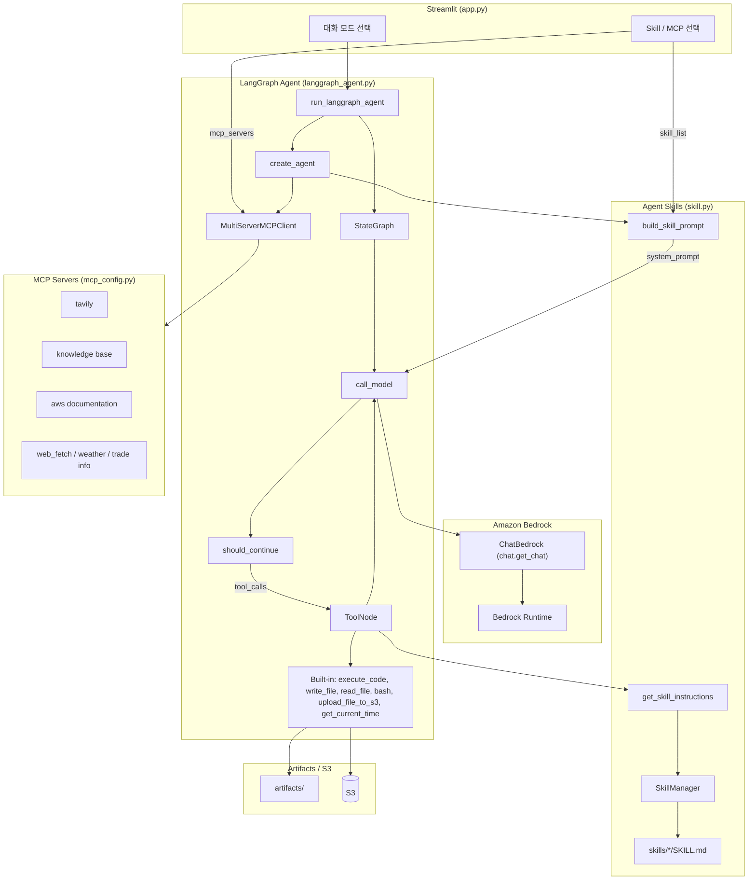

# MCP/SKILL을 이용한 Agent의 구현

Agent는 MCP뿐 아니라 [Skill](https://github.com/anthropics/skills)을 활용하여 다양한 기능을 편리하게 구현할 수 있습니다. 여기에서는 [LangGraph](https://www.langchain.com/langgraph)에서 Agent skill을 활용하는 방법에 대해 설명합니다. 전체적인 architecture는 아래와 같습니다. CloudFront - ALB - EC2로 streamlit을 안전하게 제공하고, LangGraph Agent에 MCP와 Skills 기능을 구현합니다.


- **MCP**: 외부 도구(검색, Knowledge Base, 날씨 등)를 구조화된 tool로 제공
- **Skills**: `SKILL.md` 기반 절차·도메인 지침을 온디맨드로 로드 (`get_skill_instructions`)

## 설치

### 사전 준비

1. AWS 환경을 잘 활용하기 위해서는 [AWS CLI를 설치](https://docs.aws.amazon.com/ko_kr/cli/v1/userguide/cli-chap-install.html)하여야 합니다. EC2에서 배포하는 경우에는 별도로 설치가 필요하지 않습니다. Local에 설치시는 아래 명령어를 참조합니다.

```text
curl "https://awscli.amazonaws.com/awscli-exe-linux-x86_64.zip" -o "awscliv2.zip" 
unzip awscliv2.zip
sudo ./aws/install
```

AWS credential을 아래와 같이 AWS CLI를 이용해 등록합니다.

```text
aws configure
```

2. 설치하다가 발생하는 각종 문제는 [Kiro-cli](https://aws.amazon.com/ko/blogs/korea/kiro-general-availability/)를 이용해 빠르게 수정합니다. 아래와 같이 설치할 수 있지만, Windows에서는 [Kiro 설치](https://kiro.dev/downloads/)에서 다운로드 설치합니다. 실행시는 셀에서 "kiro-cli"라고 입력합니다. (Windows 미지원)

```python
curl -fsSL https://cli.kiro.dev/install | bash
```

venv로 환경을 구성하면 편리하게 패키지를 관리합니다. 아래와 같이 환경을 설정합니다.

```text
python -m venv .venv
source .venv/bin/activate
```


3. [knowledge-base-with-s3-vector.md](./knowledge-base-with-s3-vector.md)에 따라 AWS의 완전관리형 RAG 서비스인 Knowledge Base를 설치합니다. Vector Store로 S3 Vector를 선택하면 embedding된 문서 정보가 Amazon S3에 저장되므로 매우 경제적입니다. 다만 성능을 최적화하기 원할때에는 S3 Vector 보다는 OpenSearch Serverless등을 활용합니다.

4. 인터넷 검색을 위하여 [Tavily Search](https://app.tavily.com/sign-in)에 접속하여 가입 후 API Key를 발급합니다. 이것은 tvly-로 시작합니다.  

5. git code를 다운로드합니다.

```text
git clone https://github.com/kyopark2014/langgraph-skills
```

6. 아래 명령어로 config.json을 생성합니다. 이때 앞에서 생성한 "S3 bucket name", "Knowledge Base ID", "Tavily API Key"을 입력합니다.

```text
python update_config.py
```

7. 다운로드 받은 github 폴더로 이동한 후에 아래와 같이 필요한 패키지를 추가로 설치 합니다.

```text
pip install -r requirement.txt
```

8. MCP `web_fetch`(`mcp-server-fetch-typescript`, Playwright 포함)로 웹을 markdown 등으로 가져오려면 저장소 루트에서 아래 명령으로 Node 패키지를 설치합니다.

```text
npm install
```

렌더된 HTML을 가져오는 도구를 쓸 때는 최초 한 번 `npx playwright install`으로 브라우저 바이너리를 설치해야 할 수 있습니다.

### 실행

```text
streamlit run application/app.py
```

## Skills

[Agent Skills](https://agentskills.io/specification)은 AI agent에게 특정 작업 수행 방법을 가르치는 재사용 가능한 지침 패키지입니다. Skill은 context를 효율적으로 관리하기 위해 **discovery → activation → execution** 과정을 거칩니다.

1. **Discovery**: agent가 관련 skill의 `name`과 `description`을 확인
2. **Activation**: `SKILL.md`의 instruction(본문)을 로드
3. **Execution**: 필요 시 referenced file을 읽거나 bundled code를 `execute_code` / `bash`로 실행

각 스킬은 `SKILL.md` 파일로 구성되며, YAML 프론트매터(`name`, `description`)와 상세 지침(워크플로, 코드 패턴 등)으로 이루어져 있습니다.

### Operation Architecture



| 모드 | 모듈 | 설명 |
|------|------|------|
| 일상적인 대화 | `chat.general_conversation` | 대화 이력 + ChatBedrock 스트리밍 |
| RAG | `chat.run_rag_with_knowledge_base` | Bedrock Knowledge Base 검색(`retrieve`) 후 ChatBedrock으로 답변 생성 |
| **Agent** | `langgraph_agent.run_langgraph_agent` | LangGraph StateGraph + built-in tools + MCP + Skills (단일 턴) |
| **Agent (Chat)** | `langgraph_agent.run_langgraph_agent` | Agent와 동일 + LangGraph checkpointer로 대화 이력 유지 |
| 이미지 분석 | `chat.summarize_image` | ChatBedrock 멀티모달 (이미지 + 텍스트) 분석 |

### Progressive Disclosure

시스템 프롬프트에는 스킬의 **이름과 설명만** XML로 넣고, 상세 지침은 agent가 `get_skill_instructions`를 호출해 **필요할 때만** 로드합니다. 프롬프트 크기를 줄이면서도 여러 스킬을 선택적으로 쓸 수 있습니다.

```xml
<available_skills>
  <skill>
    <name>docx</name>
    <description>Word 문서(.docx) 생성/편집/분석 ...</description>
  </skill>
  <skill>
    <name>pdf</name>
    <description>PDF 파일 읽기/병합/분할/OCR/폼 처리 등</description>
  </skill>
</available_skills>
```

### 스킬의 구조

각 스킬은 `SKILL.md`가 핵심이며, 필요 시 `scripts/`, `references/`, `assets/` 등을 둡니다.

```text
application/skills/
├── docx/
│   ├── SKILL.md
│   └── scripts/
├── pdf/
│   └── SKILL.md
├── pptx/
│   └── SKILL.md
└── skill-creator/
    └── SKILL.md
```

`SKILL.md` 예 (프론트매터 + 본문):

```markdown
---
name: docx
description: Use this skill whenever the user wants to create, read, edit, or manipulate Word documents (.docx files). ...
---

# DOCX creation, editing, and analysis

## Overview
A .docx file is a ZIP archive containing XML files.
...
```

### 포함된 스킬

이 프로젝트는 `application/skills/` 아래 **베이스 스킬만** 사용합니다 (플러그인 스킬 없음).

| 스킬 | 설명 |
|------|------|
| docx | Word 문서 생성/편집/분석 |
| pdf | PDF 읽기/병합/분할/OCR/폼 처리 |
| pptx | PowerPoint 읽기/편집/생성 |
| xlsx | 스프레드시트 작업 |
| myslide | AWS 테마 프레젠테이션 생성 |
| ppt-translator | PPT 번역 |
| pdf2img | PDF → 이미지 |
| img2text | 이미지 → 텍스트(Bedrock 멀티모달) |
| skill-creator | 새 스킬 설계/패키징 가이드 |
| graphify | 지식 그래프 구축/조회 |
| tavily-search | Tavily 검색 스크립트 |
| retrieve | Bedrock Knowledge Base RAG |
| kma-weather / search-weather | 날씨 조회 |
| notion / gog | Notion / Google Workspace 가이드 |
| browser-use | 브라우저 자동화 |
| frontend-design | UI/프론트엔드 디자인 |
| memory-manager | MEMORY.md 기반 메모리 관리 |

활성화할 스킬은 `config.json`의 `default_skills`와 Streamlit 사이드바 **Skill Config** 체크박스로 선택합니다. **Skill Mode**가 켜져 있어야 skill tool/프롬프트가 agent에 붙습니다.

### 스킬의 동작 흐름

[skill.py](./application/skill.py) 기준 흐름:

1. **스킬 탐색**: `SkillManager`가 `skills/*/SKILL.md`를 스캔해 레지스트리에 등록
2. **프롬프트 구성**: `build_skill_prompt(skill_info)`가 선택된 스킬의 이름/설명을 `<available_skills>` XML로 시스템 프롬프트에 포함
3. **지침 로드**: 관련 요청이면 agent가 `get_skill_instructions(skill_name)` 호출
4. **작업 수행**: 지침에 따라 `execute_code`, `bash`, `write_file` 등 실행 (MCP 도구와 병행 가능)
5. **결과 전달**: 산출물은 `artifacts/`에 두고, 설정 시 `upload_file_to_s3`로 URL 제공

### LangGraph에서 Skill 구현

#### 1) Agent 생성 (`create_agent`)

[langgraph_agent.py](./application/langgraph_agent.py)의 `create_agent`가 builtin + MCP + Skill을 한 번에 조립합니다. Skill Mode가 `Enable`일 때만 skill tool과 skill 프롬프트를 붙입니다.

```python
async def create_agent(mcp_servers: list, skill_list: list, history_mode: str = "Disable"):
    tools = get_builtin_tools()  # execute_code, write_file, read_file, bash, ...

    mcp_json = mcp_config.load_selected_config(mcp_servers)
    server_params = load_multiple_mcp_server_parameters(mcp_json)
    client = MultiServerMCPClient(server_params)
    mcp_tools = await client.get_tools()
    tools.extend(mcp_tools)

    if chat.skill_mode == "Enable":
        tools.extend(skill.get_skill_tools())  # get_skill_instructions
        skill_info = skill.get_skill_info(skill_list)
        system_prompt = skill.build_skill_prompt(skill_info)
    else:
        system_prompt = BASE_SYSTEM_PROMPT

    app = buildChatAgent(tools)  # or buildChatAgentWithHistory
    agent_config = {
        "recursion_limit": 100,
        "configurable": {
            "thread_id": chat.user_id,
            "tools": tools,
            "system_prompt": system_prompt,
        },
        "tools": tools,
        "system_prompt": system_prompt,
    }
    return app, agent_config
```

#### 2) Builtin tools

```python
def get_builtin_tools() -> list:
    tools = [execute_code, write_file, read_file, bash, get_current_time]
    if sharing_url or config.get("s3_bucket"):
        tools.append(upload_file_to_s3)
    return tools
```

`get_skill_instructions`는 builtin이 아니라 [skill.py](./application/skill.py)의 `get_skill_tools()`로 별도 추가됩니다.

```python
@tool
def get_skill_instructions(skill_name: str) -> str:
    """Load the full instructions for a specific skill by name."""
    manager = _get_manager()
    instructions = manager.get_skill_instructions(skill_name)
    if instructions:
        return instructions
    available = ", ".join(manager.registry.keys())
    return f"Skill '{skill_name}' not found. Available skills: {available}"
```

#### 3) SkillManager / 프롬프트

```python
@dataclass
class Skill:
    name: str
    description: str
    instructions: str
    path: str

class SkillManager:
    def __init__(self, skills_dir: str = SKILLS_DIR):
        self.registry: dict[str, Skill] = {}
        self._discover(skills_dir)

    def _discover(self, skills_dir: str):
        for entry in os.listdir(skills_dir):
            skill_md = os.path.join(skills_dir, entry, "SKILL.md")
            if os.path.isfile(skill_md):
                meta, instructions = self._parse_skill_md(skill_md)
                skill = Skill(
                    name=meta.get("name", entry),
                    description=meta.get("description", ""),
                    instructions=instructions,
                    path=os.path.join(skills_dir, entry),
                )
                self.registry[skill.name] = skill

def build_skill_prompt(skill_info: list) -> str:
    path_info = (
        f"## Paths ...\n"
        f"- WORKING_DIR: {WORKING_DIR}\n"
        f"- ARTIFACTS_DIR: {ARTIFACTS_DIR}\n"
    )
    skills_xml = get_skills_xml(skill_info)
    return f"{SKILL_SYSTEM_PROMPT}\n{path_info}\n{skills_xml}\n{SKILL_USAGE_GUIDE}"
```

#### 4) UI → Agent 호출

[app.py](./application/app.py)에서 Skill/MCP를 선택한 뒤 `chat.run_langgraph_agent`로 위임하고, 실제 실행은 `langgraph_agent.run_langgraph_agent`가 담당합니다.

```python
# app.py (Agent / Agent Chat)
response, image_url = asyncio.run(chat.run_langgraph_agent(
    query=prompt,
    mcp_servers=mcp_servers,
    skill_list=selected_skills,
    history_mode=history_mode,
    notification_queue=notification_queue,
))
```

```python
# chat.py — thin wrapper
async def run_langgraph_agent(query, mcp_servers, history_mode, notification_queue, skill_list=None):
    return await langgraph_agent.run_langgraph_agent(
        query=query,
        mcp_servers=mcp_servers,
        skill_list=skill_list or [],
        history_mode=history_mode,
        notification_queue=notification_queue,
    )
```

MCP/skill/skill_mode가 바뀌면 agent를 재생성하고, 같으면 캐시된 그래프를 재사용합니다.

### Skill 생성

[skill-creator](./application/skills/skill-creator/SKILL.md)를 선택하면 새 스킬 패키징을 안내합니다.

```text
├── SKILL.md              # 필수
│   ├── YAML frontmatter  # name, description (필수)
│   └── Markdown body     # 상세 지침 (필수)
└── Bundled Resources     # 선택
    ├── scripts/          # 실행 코드
    ├── references/       # 온디맨드 문서
    └── assets/           # 템플릿, 아이콘, 폰트 등
```

새 폴더를 `application/skills/<name>/`에 두고 `SKILL.md`를 추가하면 다음 앱 실행(또는 SkillManager 재생성) 시 UI 체크박스에 나타납니다.

## 결과

"contents/stock_prices.csv를 읽어서 그래프로 그리고 설명하세요."라고 입력후 결과를 확인합니다.

이어서 "결과를 Word 파일로 정리해주세요."라고 하면 (`docx` skill + Skill Mode 선택 시) Word 파일로 저장할 수 있습니다.

## Reference

- [Agent Skills Specification](https://agentskills.io/specification)
- [anthropics/skills](https://github.com/anthropics/skills)
- [Agent Skills Home](https://agentskills.io/home)
